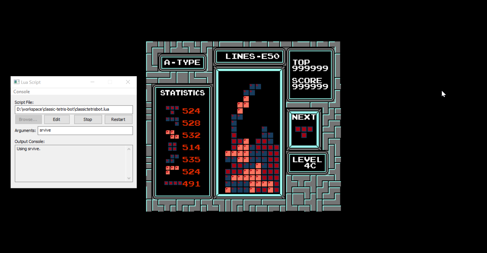

# classic-tetris-bot
Script + utility for bots to play NES Tetris on the FCEUX emulator.

## Usage
First of all, I'm afraid this only works in Windows. My apologies.

1. Download FCEUX and a copy of the original Tetris (NES) ROM. Make sure the ROM and joypad input works in FCEUX.
2. Clone this repository to your computer. Run the script build.bat to generate the bot executable from the C++ files.
3. In FCEUX, go to File -> Lua -> New Lua Script Window.
4. In the Lua Script window, open classictetrisbot.lua (but don't run it yet).
5. In the Arguments field, put "srvive -d". This will run the bot named "srvive." The -d flag will put a green highlight where the bot has chosen to place a piece.
5. In FCEUX, open the Tetris ROM file.
6. Get to the Type A level select screen and hover over 9 (it might be smart to make a savestate here). Press Run in the Lua Script window to run the bot and start the game.

## Writing Bots
A "bot" is basically a function that evaluates a decision and outputs a number, a higher number represents a better decision. Writing a simple bot is pretty easy, and you can use this repository as a framework to write your own.

1. In the src/bots/ directory, create a new .h file for your bot. Let's call it `newbot.h`.
2. Copy the following into the file:
```C++
#include "../bot.h"

double newbot(decision_t decision) {
    // ...
}
```
3. Replace `newbot` with whatever you want to call your function.
4. Write your function. Good luck, more on this later.
5. Navigate to the src/ directory and open `bot_list.h`.
6. `#include` your header file.
7. In the array `bot_list`, make a new entry:
```C++
{"newbot", newbot}
```
8. Again, replace `newbot` with your bot name.
9. Save everything and run build.bat again.
10. You're done! Now when you run the script in FCEUX, put your bot name in the arguments.

## Bots

### SRVIVE

Short for "Survive" (or Senor Vive). One of the first bots, written to maxout through sheer force of will (a.k.a., getting a lot of lines). Here's a screenshot of SRVIVE making it all the way to the undefined territory from a level 19 start:



### NOOBHR

In honor of CTWC Tetris legend Jonas Neubauer. My attempt at writing an efficient bot, has maxed out a few times but needs some work.

### XORSTK

XOR-stack, a weird bit-manip-abuse bot with a 10-line evaluator function. Performs extremely well for its size.
